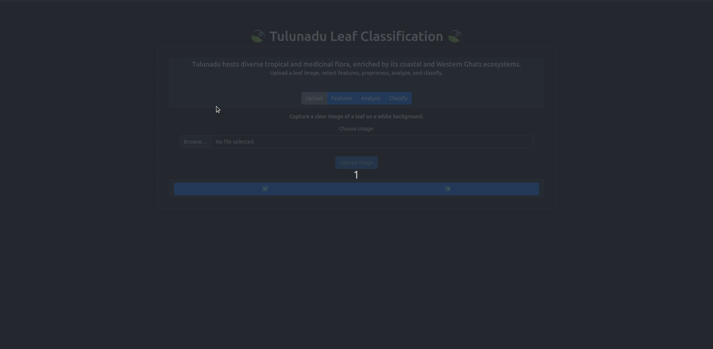

# Leaf Detector ML



> An understanding of the natural world and what's in it is a source of not only a great curiosity, but great fulfillment. 
-David Attenborough


## Description

An ML-based web application for classifying leaves of the Tulunadu region using traditional feature extraction techniques — **no deep learning or CNNs involved**. Built with just React, Django, and python, for my friend eric's mini project. 

---

## Features

- Upload leaf images for classification
- 📐 Traditional feature extraction (color, texture, shape)
- 🤖 Classical ML algorithms for prediction
- 🌐 Fast, responsive frontend built with React
- 🔌 Django Backend

---

## Tech Stack

- React
- Python (Django)
- Virtual environment (`venv`) setup for dependency management

---
## Project Structure

leaf-detector-ML/  <br>
│                   <br>
├── backend/               # Python ML logic + API <br>
├── src/                   # React components and logic <br>
├── venv/                  # Python virtual environment <br>
├── package.json           # Node dependencies <br>
├── vite.config.js         # Vite config <br>
└── README.md              # You're here! <br>


## Getting Started

### 1. Clone the Repository

```bash
git clone https://github.com/AlliedLens/leaf-detector-ML.git
cd leaf-detector-ML
```

### 2. Setting up the frontend

```bash
npm install 
npm run dev
```

### 3. Setting up the backend

```bash
cd backend
source venv/bin/activate
pip install -r requirements.txt
python3 manage.py makemigrations
python3 manage.py migrate
python3 manage.py runserver 8000
```